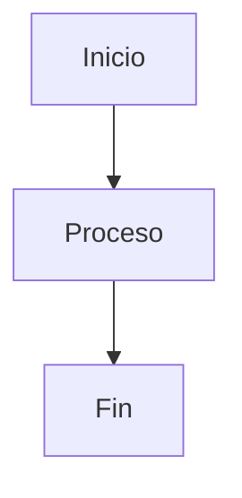

# Documentación Blockchain API

Documentación técnica detallada con diagramas interactivos Mermaid.

## 📚 Índice de Documentación

### Diagramas de Arquitectura

1. **[Arquitectura del Sistema](./arquitectura-sistema.md)**
   - Diagrama completo de componentes
   - Interacciones entre servicios
   - Stack tecnológico

2. **[Modelo de Datos](./modelo-datos.md)**
   - Comparación Light vs Heavy Model
   - Casos de uso recomendados
   - Flujo de decisión

3. **[Estructura del Proyecto](./estructura-proyecto.md)**
   - Organización de archivos y directorios
   - Descripción de cada componente
   - Flujo de datos entre componentes

### Diagramas de Flujo

4. **[Flujo de Guardar Datos](./flujo-guardar-datos.md)**
   - POST /guardar-json
   - Proceso completo de escritura
   - Persistencia dual (Blockchain + MySQL)

5. **[Flujo de Leer Datos](./flujo-leer-datos.md)**
   - GET /leer-json/:tipo/:txid
   - Proceso de lectura
   - Recuperación de metadatos

### Diagramas de Secuencia

6. **[Secuencia Completa](./secuencia-completa.md)**
   - Interacciones entre componentes
   - Diagramas de secuencia
   - Tiempos de respuesta
   - Flujos de autenticación y consenso

## 🎯 Guía de Navegación

### Para Desarrolladores Nuevos
1. Comienza con [Arquitectura del Sistema](./arquitectura-sistema.md)
2. Revisa [Modelo de Datos](./modelo-datos.md) para entender las estrategias
3. Estudia los flujos: [Guardar](./flujo-guardar-datos.md) y [Leer](./flujo-leer-datos.md)

### Para Arquitectos
1. [Arquitectura del Sistema](./arquitectura-sistema.md) - Vista general
2. [Secuencia Completa](./secuencia-completa.md) - Interacciones detalladas
3. [Modelo de Datos](./modelo-datos.md) - Decisiones de diseño

### Para Operaciones
1. [Secuencia Completa](./secuencia-completa.md) - Tiempos de respuesta
2. [Flujo de Guardar Datos](./flujo-guardar-datos.md) - Puntos de monitoreo
3. [Flujo de Leer Datos](./flujo-leer-datos.md) - Optimizaciones

## 🔧 Cómo Usar los Diagramas

Los diagramas están escritos en **Mermaid**, que permite:

### Visualización en GitHub
Los archivos `.md` se renderizan automáticamente en GitHub con los diagramas interactivos.

### Visualización en VS Code
1. Instalar extensión: `Mermaid Preview`
2. Abrir archivo `.md`
3. Usar comando: `Mermaid: Preview`

### Edición de Diagramas
Los diagramas son código Mermaid puro, puedes editarlos directamente:

### Exportar Diagramas
- **PNG/SVG**: Usar [Mermaid Live Editor](https://mermaid.live/)
- **PDF**: Exportar desde VS Code con extensión
- **Presentaciones**: Integrar en Markdown presentations

## 📖 Convenciones de Diagramas

### Colores

| Color | Significado |
|-------|-------------|
| 🟢 Verde | Operación exitosa |
| 🔴 Rojo | Error o fallo |
| 🟡 Amarillo | Proceso light/rápido |
| 🟠 Naranja | Proceso heavy/pesado |
| 🔵 Azul | Base de datos |
| 🟣 Morado | Métricas/Monitoreo |

### Formas

| Forma | Uso |
|-------|-----|
| Rectángulo | Proceso/Acción |
| Rombo | Decisión |
| Cilindro | Base de datos |
| Círculo | Inicio/Fin |
| Rectángulo doble | Subproceso |

## 🔄 Actualización de Diagramas

Para actualizar un diagrama:

1. Editar el archivo `.md` correspondiente
2. Modificar el código Mermaid
3. Previsualizar cambios
4. Commit y push

## 📝 Contribuir

Si quieres mejorar la documentación:

1. Fork el repositorio
2. Crea una rama: `git checkout -b docs/mejora-diagramas`
3. Edita los archivos en `docs/`
4. Commit: `git commit -m "docs: mejora diagrama de arquitectura"`
5. Push y crea Pull Request

## 🔗 Referencias

- [Mermaid Documentation](https://mermaid.js.org/)
- [Mermaid Live Editor](https://mermaid.live/)
- [Hyperledger Fabric Docs](https://hyperledger-fabric.readthedocs.io/)

---

**Última actualización**: Diciembre 17, 2025
