# Arquitectura del Sistema - Blockchain API

Este diagrama muestra la arquitectura completa del sistema y cómo interactúan los diferentes componentes.

## Componentes Principales

| Componente | Tecnología | Función |
|-----------|-----------|---------|
| **Servidor API** | Node.js 14+ + Express 5.x | Manejo de peticiones HTTP y lógica de negocio |
| **Blockchain** | Hyperledger Fabric 2.2 | Almacenamiento inmutable de datos |
| **Base de Datos** | MySQL 8.0+ | Almacenamiento de metadatos y consultas rápidas |
| **Monitoreo** | Prometheus | Métricas de rendimiento y observabilidad |
| **Autenticación** | Fabric Wallet | Gestión de identidades y certificados |
