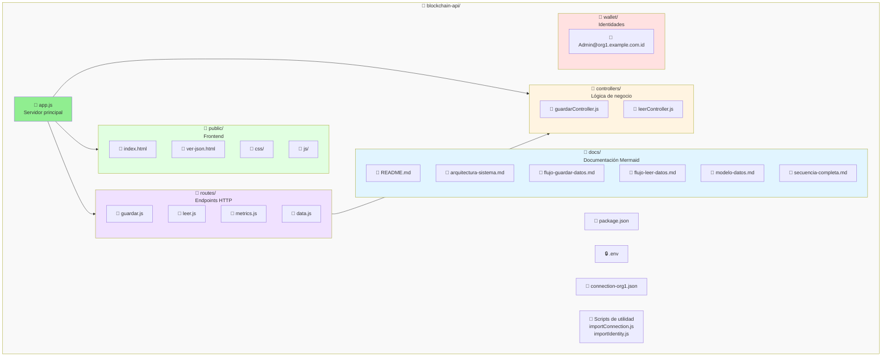
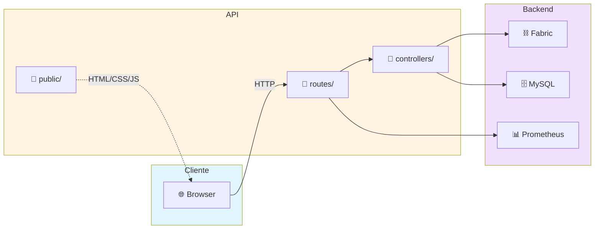

# Estructura del Proyecto

Organización completa de archivos y directorios de la Blockchain API.

```
blockchain-api/
├── 📄 app.js                          # Servidor principal Express
├── 📄 package.json                    # Dependencias y scripts NPM
├── 📄 example.env                     # Plantilla de variables de entorno
├── 🔒 .env                           # Configuración (no commitear)
├── 📄 connection-org1.json           # Perfil de conexión de Fabric
├── 📖 README.md                      # Documentación principal
├── 📜 tunnelAPI.sh                   # Script de utilidad (SSH tunnel)
├── 🎨 arquitectura-fabric-api.drawio # Diagrama de arquitectura
│
├── 📂 docs/                          # 📚 Documentación técnica
│   ├── README.md                     # Índice de documentación
│   ├── arquitectura-sistema.md      # Diagrama de arquitectura Mermaid
│   ├── flujo-guardar-datos.md       # Flujo POST /guardar-json
│   ├── flujo-leer-datos.md          # Flujo GET /leer-json
│   ├── modelo-datos.md              # Comparación Light vs Heavy
│   ├── secuencia-completa.md        # Diagramas de secuencia
│   └── estructura-proyecto.md       # Este archivo
│
├── 📂 controllers/                   # Lógica de negocio
│   ├── guardarController.js         # Controlador para guardar datos
│   └── leerController.js            # Controlador para leer datos
│
├── 📂 routes/                        # Definición de rutas HTTP
│   ├── guardar.js                   # POST /guardar-json
│   ├── leer.js                      # GET /leer-json/:tipo/:txid
│   ├── metrics.js                   # GET /metrics/tx/:txid
│   └── data.js                      # Rutas adicionales
│
├── 📂 public/                        # Frontend (archivos estáticos)
│   ├── index.html                   # Dashboard principal
│   ├── ver-json.html                # Visor de detalles de JSON
│   ├── 📂 css/
│   │   ├── style.css                # Estilos del dashboard
│   │   └── ver-json.css             # Estilos del visor
│   └── 📂 js/
│       ├── main.js                  # Lógica del dashboard
│       └── ver-json.js              # Lógica del visor
│
├── 📂 wallet/                        # Identidades de Fabric
│   └── Admin@org1.example.com.id    # Identidad del admin (generada)
│
├── 📜 importConnection.js           # Script para importar perfil de conexión
└── 📜 importIdentity.js             # Script para importar identidad
```

## 📊 Diagrama de Estructura



## 📂 Descripción de Directorios

### `/docs` - Documentación Técnica
Contiene toda la documentación con diagramas Mermaid interactivos:
- Arquitectura del sistema
- Flujos de operación
- Modelos de datos
- Diagramas de secuencia

### `/controllers` - Controladores
Implementa la lógica de negocio:
- **guardarController.js**: Maneja el proceso de guardar datos en blockchain y MySQL
- **leerController.js**: Maneja la recuperación de datos desde blockchain y MySQL

### `/routes` - Rutas HTTP
Define los endpoints de la API:
- **guardar.js**: POST /guardar-json
- **leer.js**: GET /leer-json/:tipo/:txid
- **metrics.js**: GET /metrics/tx/:txid
- **data.js**: Rutas adicionales

### `/public` - Frontend
Interfaz web estática:
- **index.html**: Dashboard principal con lista de registros
- **ver-json.html**: Visor detallado de un registro específico
- **css/**: Hojas de estilo
- **js/**: Scripts del cliente

### `/wallet` - Identidades Fabric
Almacena las identidades de Hyperledger Fabric:
- Certificados X.509
- Claves privadas
- Metadatos de identidad

## 📄 Archivos Principales

### Configuración

| Archivo | Descripción |
|---------|-------------|
| `app.js` | Servidor Express principal, configura middleware y rutas |
| `package.json` | Dependencias del proyecto y scripts NPM |
| `.env` | Variables de entorno (MySQL, Fabric, Prometheus) |
| `example.env` | Plantilla para crear el archivo .env |
| `connection-org1.json` | Perfil de conexión a la red Fabric |

### Scripts de Utilidad

| Archivo | Descripción |
|---------|-------------|
| `importConnection.js` | Importa el perfil de conexión desde Fabric test-network |
| `importIdentity.js` | Importa la identidad de Admin a la wallet local |
| `tunnelAPI.sh` | Script bash para crear túnel SSH (si es necesario) |

## 🔧 Archivos de Configuración

### package.json

```json
{
  "name": "fabric-api",
  "version": "1.0.0",
  "scripts": {
    "start": "node app.js",
    "import": "node importConnection.js && node importIdentity.js"
  },
  "dependencies": {
    "express": "^5.1.0",
    "fabric-network": "^2.2.20",
    "mysql2": "^3.14.2",
    "dotenv": "^17.2.0",
    ...
  }
}
```

### .env (ejemplo)

```env
PORT=3460
DB_HOST=127.0.0.1
DB_PORT=3306
DB_USER=blockchain_user
DB_PASSWORD=tu_password
DB_NAME=blockchain_hlf
CCP_PATH=./connection-org1.json
WALLET_PATH=./wallet
IDENTITY=Admin@org1.example.com
LIGHT_CHANNEL=lightchannel
HEAVY_CHANNEL=heavychannel
CHAINCODE_NAME=jsonstoragemodel
PROMETHEUS_URL=http://localhost:9090
```

## 📊 Flujo de Datos entre Componentes



## 📝 Convenciones de Nombres

### Archivos
- **Controllers**: `[nombre]Controller.js` (camelCase)
- **Routes**: `[nombre].js` (lowercase)
- **Frontend**: `[nombre]-[tipo].html` (kebab-case)

### Código
- **Variables**: camelCase (`txidLight`, `connectionProfile`)
- **Constantes**: UPPER_SNAKE_CASE (`LIGHT_CHANNEL`, `DB_HOST`)
- **Funciones**: camelCase (`guardarJson`, `leerJson`)
- **Clases**: PascalCase (`Gateway`, `Wallet`)

## 🔄 Ciclo de Vida de una Request

1. **Cliente** envía request → `public/js/main.js`
2. **Express** recibe en → `app.js`
3. **Router** delega a → `routes/[nombre].js`
4. **Controller** procesa → `controllers/[nombre]Controller.js`
5. **Servicios** interactúan con:
   - Hyperledger Fabric (blockchain)
   - MySQL (base de datos)
   - Prometheus (métricas)
6. **Response** regresa por la cadena hasta el cliente

## 📚 Documentación Relacionada

- [Arquitectura del Sistema](./arquitectura-sistema.md)
- [Flujo de Guardar Datos](./flujo-guardar-datos.md)
- [Flujo de Leer Datos](./flujo-leer-datos.md)
- [Modelo de Datos](./modelo-datos.md)
- [Secuencia Completa](./secuencia-completa.md)

---

**Última actualización**: Diciembre 17, 2025
