# Flujo de Guardar Datos - POST /guardar-json

Este diagrama muestra el flujo completo de operaciones cuando se guardan datos en la blockchain.

## Puntos Clave

- **Tiempo estimado**: 200-500ms (dependiendo de la red y tamaño de datos)
- Las transacciones light y heavy se ejecutan en **serie** (no paralelo)
- Los tiempos se miden en **nanosegundos** usando `process.hrtime.bigint()`
- Cada transacción genera un **Transaction ID único**
- Si falla una transacción, todo el proceso se revierte (atomic)

## Datos Almacenados

### Light Model
- **Blockchain**: Hash SHA-256 (32 bytes)
- **MySQL**: JSON completo + metadatos

### Heavy Model
- **Blockchain**: JSON completo
- **MySQL**: Solo metadatos
