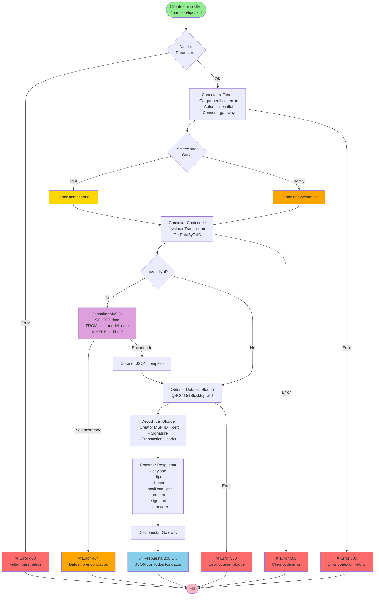

# Flujo de Leer Datos - GET /leer-json/:tipo/:txid

Este diagrama muestra el flujo completo de operaciones cuando se leen datos de la blockchain.



## Puntos Clave

- **Tiempo estimado**: 100-300ms
- Es una operación de **lectura** (evaluate), no modifica el ledger
- Para model light, se requiere consulta adicional a MySQL
- Retorna metadatos criptográficos del bloque (creator, signature)
- QSCC permite acceso de bajo nivel al bloque completo

## Respuesta Ejemplo

```json
{
  "payload": "hash_sha256_o_json_completo",
  "tipo": "light",
  "channel": "lightchannel",
  "localData": "{\"usuario\":\"john\",\"edad\":30}",
  "creator": {
    "mspid": "Org1MSP",
    "id_bytes": "-----BEGIN CERTIFICATE-----..."
  },
  "signature": "base64_signature...",
  "tx_header": {
    "channel_id": "lightchannel",
    "tx_id": "a1b2c3d4e5f6...",
    "timestamp": {...}
  }
}
```
