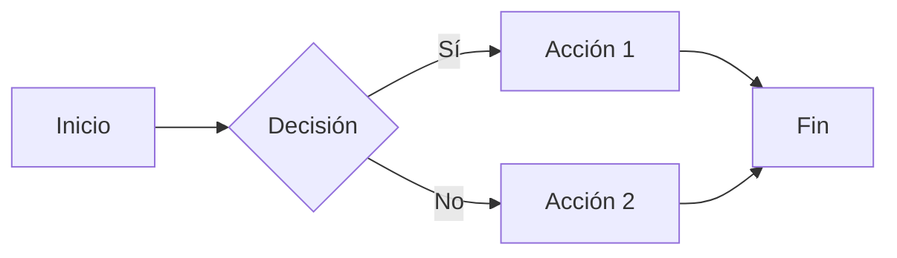
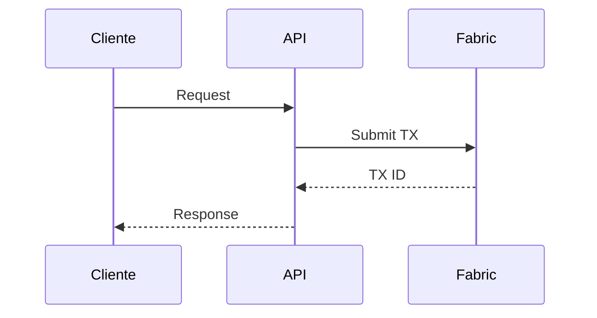
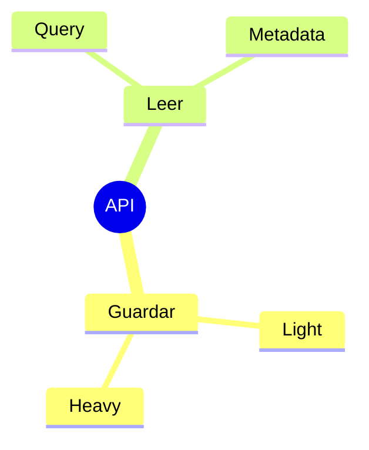
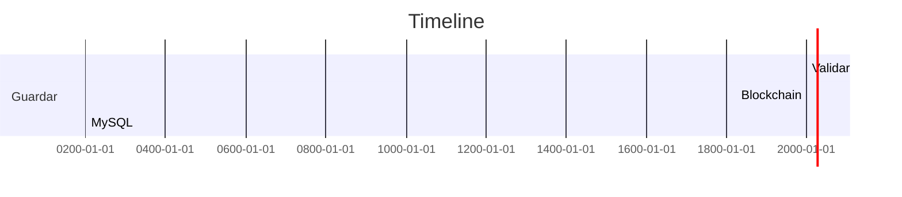
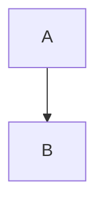
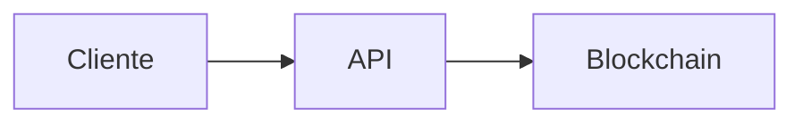
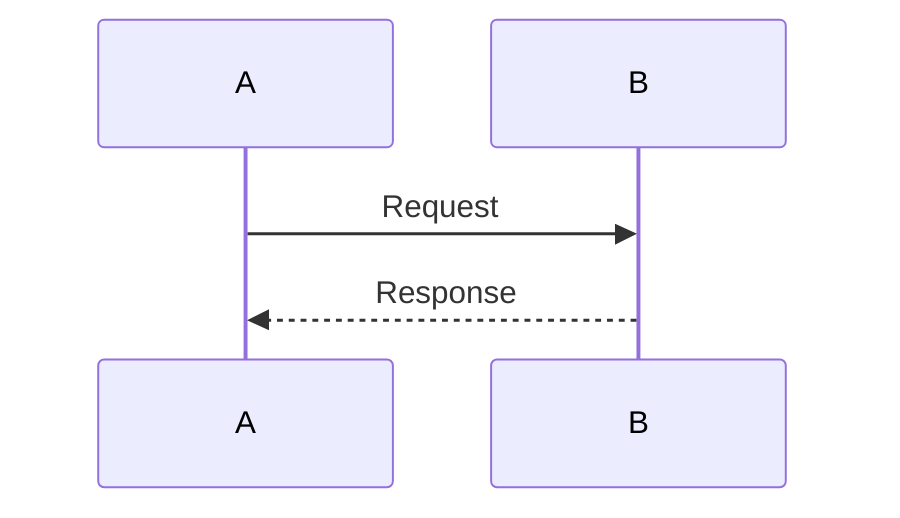
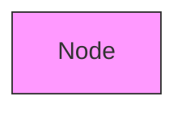

# Guía Rápida de Diagramas

Acceso rápido a todos los diagramas Mermaid de la Blockchain API.

## 🎯 Acceso Rápido

| Diagrama | Vista Previa | Uso Principal |
|----------|--------------|---------------|
| [🏗️ Arquitectura](./arquitectura-sistema.md) |  | Entender la estructura completa del sistema |
| [🪶🏋️ Modelo de Datos](./modelo-datos.md) |  | Decidir entre Light y Heavy Model |
| [📥 Guardar Datos](./flujo-guardar-datos.md) |  | Implementar escritura en blockchain |
| [📖 Leer Datos](./flujo-leer-datos.md) |  | Implementar lectura desde blockchain |
| [🔀 Secuencia](./secuencia-completa.md) |  | Debuggear interacciones entre componentes |
| [📁 Estructura](./estructura-proyecto.md) |  | Navegar el código fuente |

## 📖 Por Caso de Uso

### 🆕 Soy Nuevo en el Proyecto
1. [Arquitectura del Sistema](./arquitectura-sistema.md) - Entiende cómo funciona todo
2. [Estructura del Proyecto](./estructura-proyecto.md) - Navega los archivos
3. [Modelo de Datos](./modelo-datos.md) - Comprende la estrategia de datos

### 💻 Quiero Implementar Features
1. [Flujo de Guardar Datos](./flujo-guardar-datos.md) - Para agregar operaciones de escritura
2. [Flujo de Leer Datos](./flujo-leer-datos.md) - Para agregar operaciones de lectura
3. [Secuencia Completa](./secuencia-completa.md) - Para entender las interacciones

### 🐛 Estoy Debuggeando
1. [Secuencia Completa](./secuencia-completa.md) - Traza el flujo de datos
2. [Flujo de Guardar Datos](./flujo-guardar-datos.md) - Revisa puntos de fallo en escritura
3. [Flujo de Leer Datos](./flujo-leer-datos.md) - Revisa puntos de fallo en lectura

### 🏗️ Voy a Hacer Arquitectura
1. [Arquitectura del Sistema](./arquitectura-sistema.md) - Vista general
2. [Modelo de Datos](./modelo-datos.md) - Decisiones de diseño
3. [Estructura del Proyecto](./estructura-proyecto.md) - Organización del código

## 🎨 Tipos de Diagramas

### Graph / Flowchart

**Usado en**: Arquitectura, Flujos de Operación

### Sequence Diagram

**Usado en**: Secuencia Completa

### Mindmap

**Usado en**: Modelo de Datos (casos de uso)

### Gantt

**Usado en**: Secuencia Completa (tiempos)

## 🔧 Herramientas de Visualización

### GitHub
Los diagramas se renderizan automáticamente al ver los archivos `.md` en GitHub.

### VS Code
1. Instalar extensión: [Markdown Preview Mermaid Support](https://marketplace.visualstudio.com/items?itemName=bierner.markdown-mermaid)
2. Abrir archivo `.md`
3. `Ctrl+Shift+V` para preview

### Mermaid Live Editor
Para editar y exportar: [mermaid.live](https://mermaid.live/)

### CLI
```bash
npm install -g @mermaid-js/mermaid-cli
mmdc -i docs/arquitectura-sistema.md -o output.png
```

## 📝 Editar Diagramas

Los diagramas están en formato Mermaid puro dentro de bloques de código:

````markdown

````

Para editar:
1. Abre el archivo `.md`
2. Localiza el bloque `mermaid`
3. Edita el código según la [sintaxis Mermaid](https://mermaid.js.org/)
4. Guarda y previsualiza

## 🎓 Aprender Mermaid

### Recursos Oficiales
- [Documentación Oficial](https://mermaid.js.org/)
- [Tutorial Interactivo](https://mermaid.js.org/intro/)
- [Live Editor](https://mermaid.live/)

### Ejemplos Rápidos

**Flowchart Básico:**


**Sequence Diagram:**


**Graph con Estilos:**


## 🚀 Mejores Prácticas

### ✅ Hacer
- Usar nombres descriptivos para nodos
- Agregar colores para diferenciar componentes
- Incluir leyendas cuando sea necesario
- Mantener diagramas simples y enfocados

### ❌ Evitar
- Diagramas muy complejos (dividir en múltiples)
- Demasiados colores (máximo 5-6)
- Texto muy largo en nodos
- Cruzar muchas líneas

## 📊 Convenciones de Color

| Color | Hex | Uso |
|-------|-----|-----|
| 🟦 Azul claro | `#e1f5ff` | Cliente/Frontend |
| 🟨 Amarillo claro | `#fff4e1` | API/Backend |
| 🟪 Morado claro | `#f0e1ff` | Blockchain |
| 🟩 Verde claro | `#e1ffe1` | Base de Datos |
| 🟥 Rojo claro | `#ffe1e1` | Monitoreo/Métricas |
| 🟦 Azul | `#90EE90` | Operación exitosa |
| 🟥 Rojo | `#FF6B6B` | Error |
| 🟨 Amarillo | `#FFD700` | Light Model |
| 🟧 Naranja | `#FFA500` | Heavy Model |

## 🔄 Actualización de Diagramas

### Proceso
1. Editar archivo `.md` en `docs/`
2. Modificar código Mermaid
3. Previsualizar cambios
4. Commit con mensaje descriptivo
5. Push a repositorio

### Ejemplo de Commit
```bash
git add docs/arquitectura-sistema.md
git commit -m "docs: actualiza diagrama de arquitectura con nuevo componente Prometheus"
git push origin main
```

## 📞 Soporte

Si tienes problemas con los diagramas:
1. Verifica la sintaxis en [Mermaid Live](https://mermaid.live/)
2. Revisa la [documentación oficial](https://mermaid.js.org/)
3. Abre un issue en el repositorio

---

**Última actualización**: Diciembre 17, 2025
