# Modelos de Datos: Light vs Heavy

Comparación visual de los dos modelos de almacenamiento implementados en la API.

## Comparativa Detallada

## Casos de Uso Recomendados

### 🪶 Light Model - Casos de Uso

### 🏋️ Heavy Model - Casos de Uso

## Flujo de Decisión: ¿Qué Modelo Usar?

## Tabla Comparativa

| Característica | Light Model 🪶 | Heavy Model 🏋️ |
|---------------|----------------|-----------------|
| **Dato en Blockchain** | Hash SHA-256 (32 bytes) | JSON completo |
| **Dato en MySQL** | JSON completo | Solo metadatos |
| **Tamaño en Ledger** | Fijo, mínimo | Variable, según JSON |
| **Velocidad de escritura** | ⚡ Muy rápida | 🐢 Más lenta |
| **Inmutabilidad del contenido** | Parcial (hash) | Total (JSON) |
| **Verificabilidad** | Hash verificable | Contenido completo verificable |
| **Costo de almacenamiento** | 💰 Bajo en blockchain | 💎 Alto en blockchain |
| **Consultas** | ⚡ Muy rápidas (MySQL) | 🔍 Desde blockchain |
