# Modelos de Datos: Light vs Heavy

Comparación visual de los dos modelos de almacenamiento implementados en la API.

```mermaid
graph LR
    subgraph Input["📥 Entrada de Datos"]
        JSON["JSON Data<br/>{usuario: 'john', edad: 30}"]
    end
    
    subgraph LightModel["🪶 LIGHT MODEL"]
        LightHash["Hash SHA-256<br/>a3f5b9..."]
        LightBC["Blockchain<br/>32 bytes fijos"]
        LightDB["MySQL<br/>JSON completo<br/>+ metadatos"]
    end
    
    subgraph HeavyModel["🏋️ HEAVY MODEL"]
        HeavyJSON["JSON Completo<br/>{usuario: 'john'...}"]
        HeavyBC["Blockchain<br/>Tamaño variable"]
        HeavyDB["MySQL<br/>Solo metadatos"]
    end
    
    JSON --> LightHash
    JSON --> HeavyJSON
    
    LightHash --> LightBC
    JSON --> LightDB
    
    HeavyJSON --> HeavyBC
    HeavyJSON -.sin datos.-> HeavyDB
    
    style Input fill:#e1f5ff
    style LightModel fill:#fff9e1
    style HeavyModel fill:#ffe1f0
    style LightBC fill:#90EE90
    style HeavyBC fill:#FFA07A
    style LightDB fill:#87CEEB
    style HeavyDB fill:#DDA0DD
```

## Comparativa Detallada

```mermaid
graph TD
    subgraph Comparison["📊 Comparación de Características"]
        direction TB
        
        subgraph Light["🪶 Light Model"]
            L1["✅ Hash en Blockchain: 32 bytes"]
            L2["✅ JSON en MySQL"]
            L3["⚡ Escritura muy rápida"]
            L4["💰 Bajo costo blockchain"]
            L5["📊 Consultas rápidas"]
            L6["⚠️ Inmutabilidad parcial"]
        end
        
        subgraph Heavy["🏋️ Heavy Model"]
            H1["✅ JSON completo en Blockchain"]
            H2["✅ Solo metadata en MySQL"]
            H3["🐢 Escritura más lenta"]
            H4["💎 Alto costo blockchain"]
            H5["🔒 Inmutabilidad total"]
            H6["✅ Verificación completa"]
        end
    end
    
    style Light fill:#e8f5e9
    style Heavy fill:#fff3e0
    style L1 fill:#c8e6c9
    style L2 fill:#c8e6c9
    style L3 fill:#a5d6a7
    style L4 fill:#a5d6a7
    style L5 fill:#81c784
    style L6 fill:#fff9c4
    style H1 fill:#ffccbc
    style H2 fill:#ffccbc
    style H3 fill:#ffab91
    style H4 fill:#ff8a65
    style H5 fill:#c8e6c9
    style H6 fill:#a5d6a7
```

## Casos de Uso Recomendados

### 🪶 Light Model - Casos de Uso

```mermaid
mindmap
  root((Light Model))
    Logs de aplicación
      Eventos de usuario
      Métricas de rendimiento
      Trazas de debugging
    Datos de alta frecuencia
      Sensores IoT
      Transacciones frecuentes
      Actualizaciones en tiempo real
    Datos consultables
      Búsquedas frecuentes
      Agregaciones
      Reportes dinámicos
    Cache con respaldo
      Datos temporales
      Referencias rápidas
      Índices de búsqueda
```

### 🏋️ Heavy Model - Casos de Uso

```mermaid
mindmap
  root((Heavy Model))
    Documentos legales
      Contratos
      Acuerdos firmados
      Certificados
    Auditoría completa
      Registros financieros
      Transacciones críticas
      Compliance regulatorio
    Trazabilidad total
      Cadena de custodia
      Historiales médicos
      Registros inmutables
    Pruebas criptográficas
      Evidencia digital
      Timestamps verificables
      No repudio
```

## Flujo de Decisión: ¿Qué Modelo Usar?

```mermaid
flowchart TD
    Start{Elegir Modelo<br/>de Datos}
    
    Start --> Q1{¿Necesitas<br/>inmutabilidad<br/>total del contenido?}
    
    Q1 -->|Sí| Q2{¿Es crítico<br/>para auditoría<br/>o legal?}
    Q1 -->|No| Q3{¿Consultas<br/>frecuentes?}
    
    Q2 -->|Sí| Heavy[🏋️ HEAVY MODEL<br/>Inmutabilidad total]
    Q2 -->|No| Q4{¿Tamaño de<br/>datos grande?}
    
    Q3 -->|Sí| Light[🪶 LIGHT MODEL<br/>Consultas rápidas]
    Q3 -->|No| Q5{¿Alta frecuencia<br/>de escritura?}
    
    Q4 -->|Sí| Light
    Q4 -->|No| Heavy
    
    Q5 -->|Sí| Light
    Q5 -->|No| Hybrid[⚖️ Usar Ambos<br/>según necesidad]
    
    Heavy --> EndH[✅ Máxima seguridad<br/>y verificabilidad]
    Light --> EndL[✅ Rendimiento<br/>y eficiencia]
    Hybrid --> EndHy[✅ Balance<br/>óptimo]
    
    style Start fill:#e1f5ff
    style Heavy fill:#ffe1f0
    style Light fill:#fff9e1
    style Hybrid fill:#e1ffe1
    style EndH fill:#90EE90
    style EndL fill:#90EE90
    style EndHy fill:#90EE90
```

## Tabla Comparativa

| Característica | Light Model 🪶 | Heavy Model 🏋️ |
|---------------|----------------|-----------------|
| **Dato en Blockchain** | Hash SHA-256 (32 bytes) | JSON completo |
| **Dato en MySQL** | JSON completo | Solo metadatos |
| **Tamaño en Ledger** | Fijo, mínimo | Variable, según JSON |
| **Velocidad de escritura** | ⚡ Muy rápida | 🐢 Más lenta |
| **Inmutabilidad del contenido** | Parcial (hash) | Total (JSON) |
| **Verificabilidad** | Hash verificable | Contenido completo verificable |
| **Costo de almacenamiento** | 💰 Bajo en blockchain | 💎 Alto en blockchain |
| **Consultas** | ⚡ Muy rápidas (MySQL) | 🔍 Desde blockchain |
