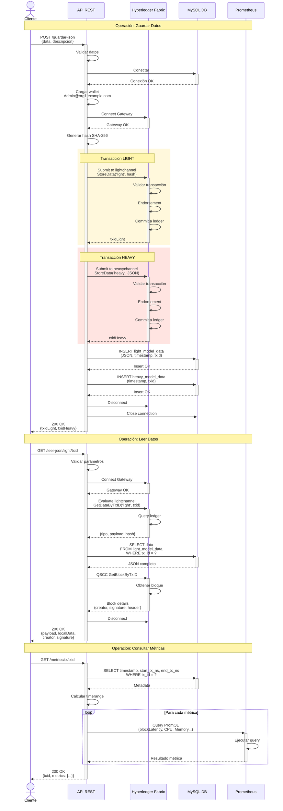
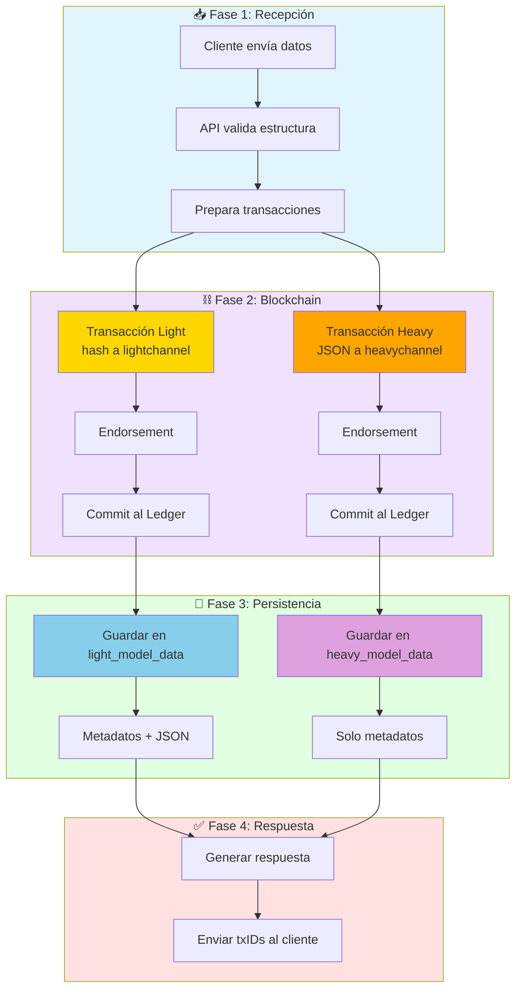
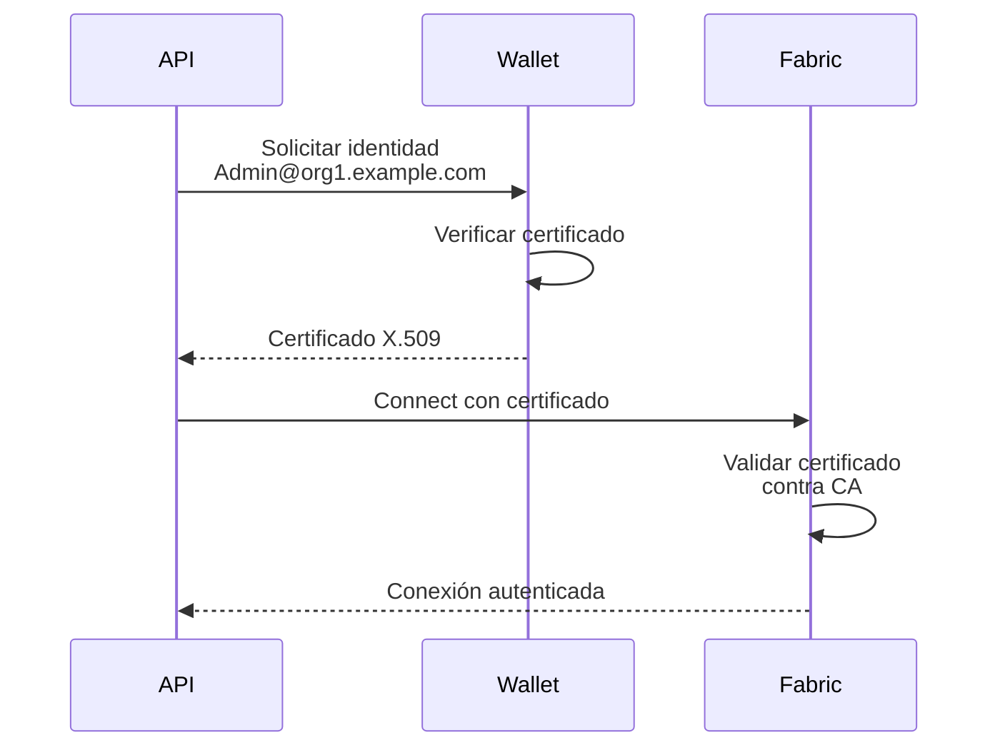
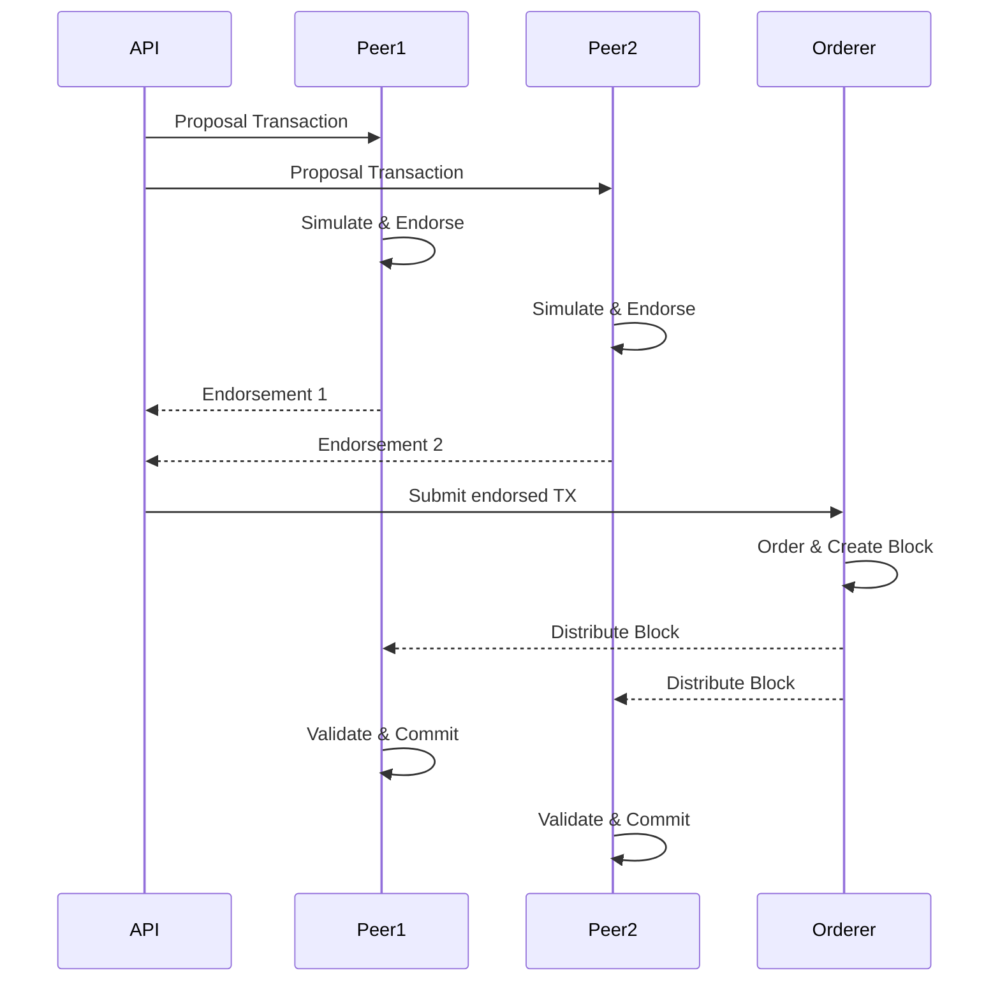

# Diagrama de Secuencia - Operación Completa

Diagrama de secuencia mostrando la interacción entre todos los componentes del sistema.

## Flujo de Datos por Componente

## Tiempos de Respuesta

```mermaid
gantt
    title Tiempos de Ejecución por Operación
    dateFormat X
    axisFormat %L ms
    
    section Guardar Datos
    Validación           :0, 5
    Conectar MySQL       :5, 15
    Cargar Wallet        :15, 25
    TX Light (blockchain):25, 175
    TX Heavy (blockchain):175, 350
    Persistir MySQL      :350, 380
    Desconectar          :380, 390
    Responder            :390, 400
    
    section Leer Datos
    Validación           :0, 5
    Conectar Fabric      :5, 25
    Query Chaincode      :25, 85
    Query MySQL (Light)  :85, 105
    Obtener Bloque       :105, 185
    Construir Respuesta  :185, 195
    Responder            :195, 200
    
    section Métricas
    Query MySQL          :0, 20
    Query Prometheus x7  :20, 180
    Procesar Respuesta   :180, 190
    Responder            :190, 200
```

## Interacciones Críticas

### 1. Autenticación y Seguridad

### 2. Endorsement y Consenso

